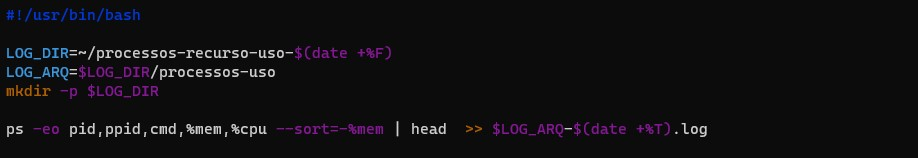
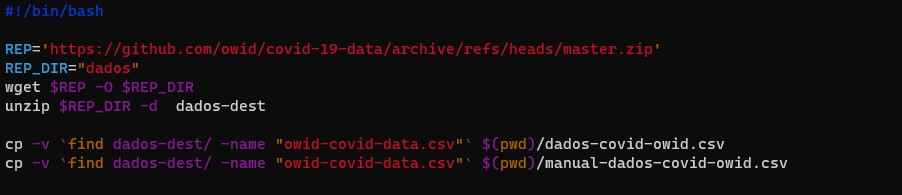
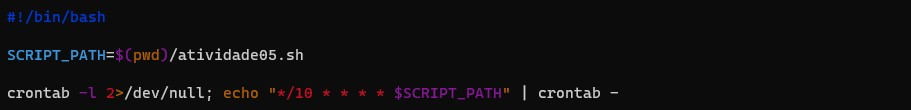

## Atividade Prática 5

1- 
Desenvolva um script que escreva em um log separado por horário, os processos que mais estejam consumindo recursos do sistema operacional, registrando sua execução em um crontab para que rode a cada 10 minutos durante o dia;

2- 
Crie um script que realize o download do repositório deste link, copie o conteúdo referente aos datasets owid-covid-data.csv e owid-covid-codebook.csv, renomeando-os para dados-covid-owid.csv e manual-dados-covid-owid.csv;

DESAFIO: Crie um script que leia os dados do arquivo dados-covid-owid.csv, extraia apenas os países e ordene em ordem alfabética salvando em um novo arquivo chamado paises-afetados-covid-owid.txt;

1-

2-

Crontab

DESAFIO

